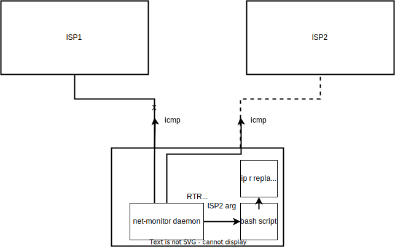

<h1 align="center">NET-MONITOR
<h3 align="center">Linux daemon for monitoring network hosts availability</h3>
 

<b>install:</b>

install make and git package:

<code>apt install make git</code>

clone this git repo:

<code>cd ~</code>

<code>git clone https://github.com/Ivashkka/net-monitor.git</code>

<code>cd net-monitor</code>

start make install from root:

<code>sudo make install; cd ~</code>

wait until installation finishes

after the installation is finished, configure conf.yaml:

<code>vim /etc/net-monitor/conf.yaml</code>

also write scripts that will react to changes in the states of network groups (see conf.yaml)

start net-monitor:

<code>systemctl start net-monitor</code>

<code>systemctl status net-monitor</code>

and enable if needed:

<code>systemctl enable net-monitor</code>

 

<b>settings:</b>

all net-monitor settings located in <code>/etc/net-monitor/conf.yaml</code>

<pre>
monitor:
  hosts: # actual hosts
    - name: ISP1
      addr: 172.16.1.1
      type: icmp # currently only icmp and command are supported
    - name: ISP2
      addr: 172.16.2.1
      type: icmp
    - name: ISP3
      addr: 172.16.3.1
      type: command
      exec: bash /usr/local/bin/check-isp3-availability.sh # exit 1 or 0 # exec param is ignored when type != command
  groups: # availability groups of hosts
    - name: HA-ISP
      hosts: [ ISP1, ISP2, ISP3 ]
      interval: 5 # seconds
      exec: /usr/local/bin/ha-isp.sh # the script is called when the availability state changes
      #with arguments indicating which hosts remain available
      #this exec param is not the same as one in hosts directive. Here you can only pass path to script
    - name: SINGLE-ISP3
      hosts: [ ISP3 ]
      interval: 10 # seconds
      exec: /usr/local/bin/isp3.sh
      #### optional group settings: ####
      args: #default arguments: ALL, <HOST>, NONE
        - default: ALL # redefinition of default 'ALL' argument to 'up' argument
          redefine: up
        - default: NONE # redefinition of default 'NONE' argument to 'down' argument
          redefine: down
</pre>

<code>hosts</code> - list of network hosts and info about it. Use icmp or command types.

<code>groups</code> - actual monitoring units. Group can contain one or more hosts. When availability ststus changes,

net-monitor calls specified in exec field script with arguments indicating which hosts remain available.

net-monitor daemon works in bg and monitors specified groups.

example of /usr/local/bin/ha-isp.sh script:

<pre>
case $1 in
    ALL)
        ip route replace default \
            nexthop via 172.16.1.1 dev enp0s3 weight 1 \
            nexthop via 172.16.2.1 dev enp0s8 weight 1
    ;;
    ISP1)
        ip route replace default via 172.16.1.1 dev enp0s3
    ;;
    ISP2)
        ip route replace default via 172.16.2.1 dev enp0s8
    ;;
esac
</pre>

where ALL, HOST, NONE - arguments passed from net-monitor on script call

you can redefine default arguments whith your own in conf.yaml

net-monitor demonstration:

 

<b>uninstall:</b>

stop net-monitor:

<code>systemctl stop net-monitor</code>

disable autorun if needed:

<code>systemctl disable net-monitor</code>

move inside net-monitor git repo directory(where you cloned net-monitor.git):

<code>cd ~/net-monitor</code>

start uninstall process:

<code>make clean</code>

 
